# 站点设置

设置页面如图所示，主要是设置一些与站点基本相关的信息，这些配置都是些常见的配置，不做过多说明

这里给个footer的例子，大家可以自行更换里面的信息

```html
© 2019-2020 
<a href="/">冷文学习者</a> 
<a target="_blank" href="https://beian.miit.gov.cn">陕ICP备19024566-1号</a>
<a style="margin-left: 10px" target="_blank" href="http://www.beian.gov.cn/portal/registerSystemInfo?recordcode=11011402012109">
    
    京公网安备11011402012109号
</a>
```

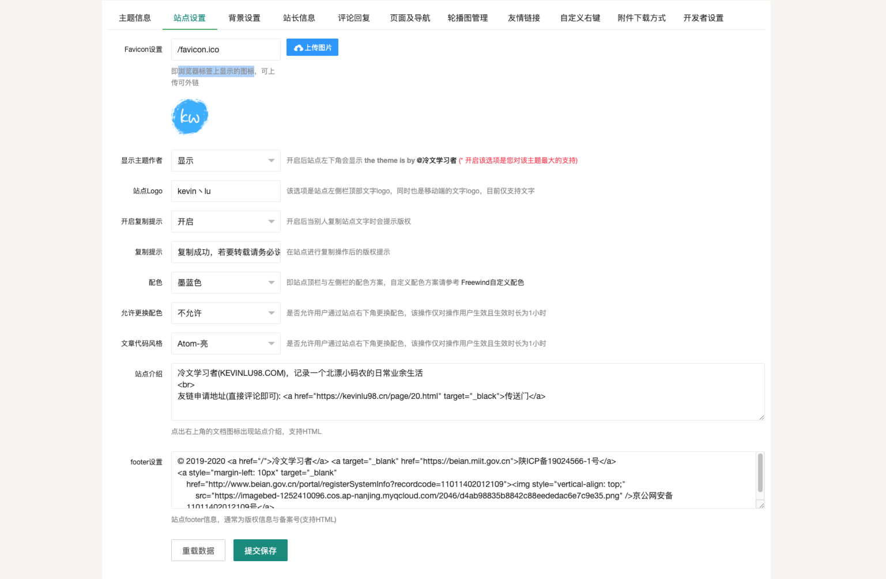

# 背景设置

这里的设置项主要就支持更换背景色及设置背景图，选择开启背景图时背景图及其透明度生效

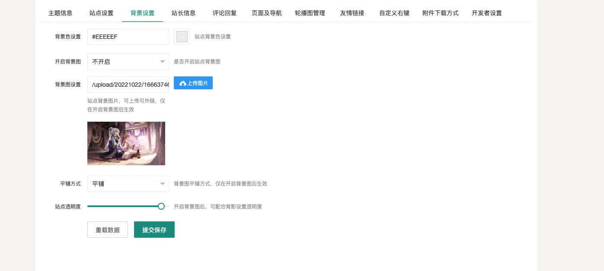


# 站长设置

站长设置里主要设置站长信息，这里的头像与说说的头像不一样，说说的头像是实际发布说说的用户的`Gavatar`头像，国内访问`Gavatar`可能会有些慢，这篇《[Typecho换Gravatar国内源](https://kevinlu98.cn/archives/32.html)》文章里有说明如何更换国内源

全站的图标采用[Font Awesome 4.7](https://www.thinkcmf.com/font_awesome.html)，格式为`fa-名称`, 就直接过来拷贝就行

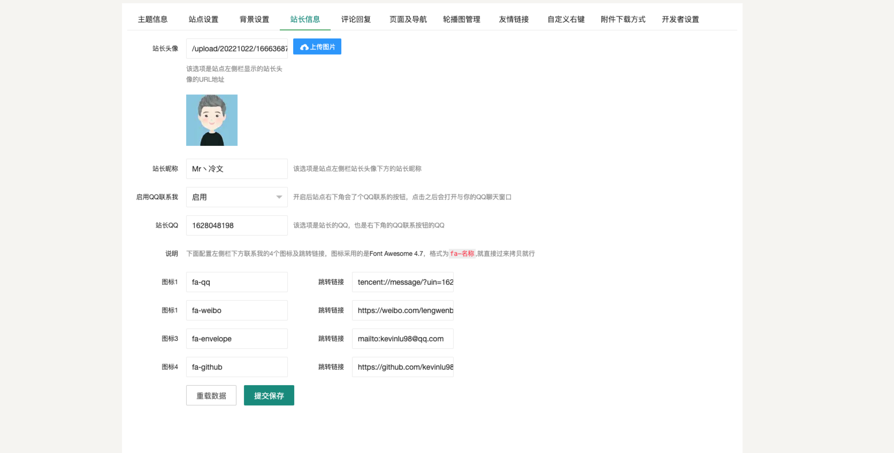

# 评论回复邮箱通知设置

这里主要是评论回复邮箱通知设置，收到评论或回复时，给被回复者及站长发送邮件通知，我这里的配置是用的腾讯企业邮箱的配置，下面我会以QQ邮箱为例给大家说如何配置

- 登录[QQ邮箱](https://mail.qq.com/)
- 在`设置 > 账号 `里找到`POP3/IMAP/SMTP/Exchange/CardDAV/CalDAV服务`

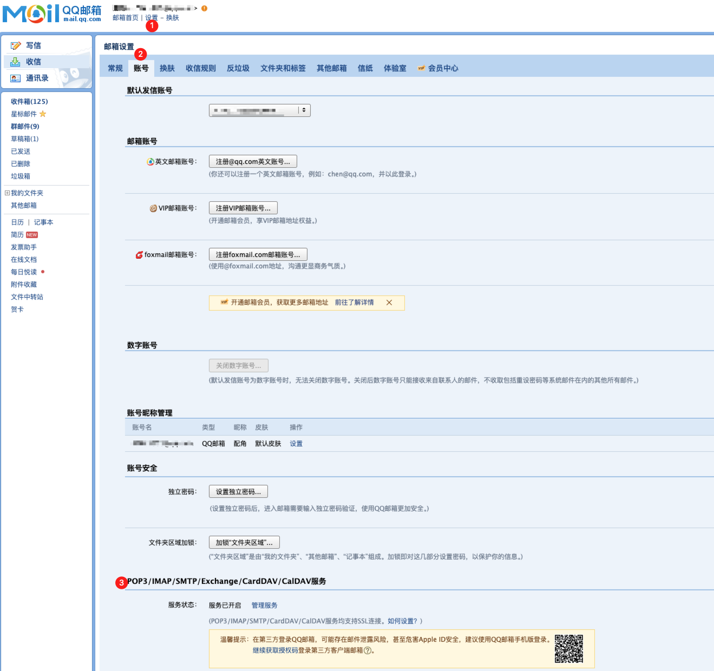

- 如果没有开启服务先开启服务，开启后如图，点获取授权码

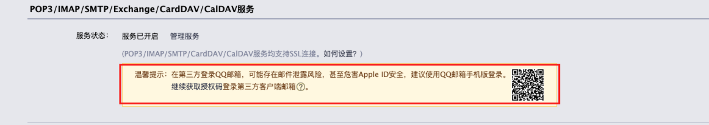

- 可以得到如图所示的授权码

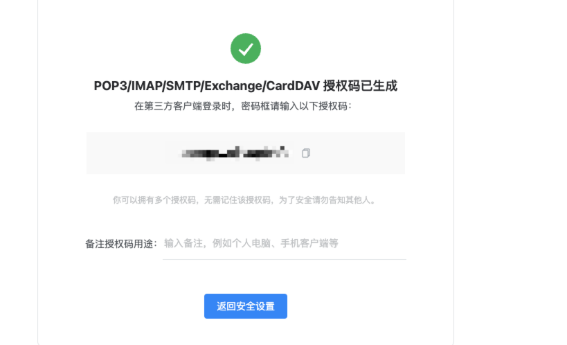

- 下面给出一些常用邮箱的smtp地址

| 邮箱类型   | SMTP服务器地址  | 端口号   |
| ---------- | --------------- | -------- |
| QQ邮箱     | smtp.qq.com     | 465或587 |
| sina邮箱   | smtp.sina.cn    | 465或587 |
| 126邮箱    | smtp.126.com    | 465或994 |
| aliyun邮箱 | smtp.aliyun.com | 465或994 |
| 163邮箱    | smtp.163.com    | 465或994 |
| yeah邮箱   | smtp.yeah.net   | 465或994 |

- 然后按照图示提示完成配置，然后点击发一封测试邮件来看配置是否成功

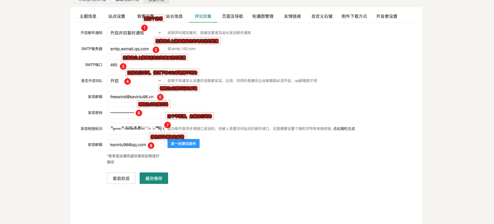

# 页面及导航设置

说明： 导航就是左侧导航部分，页面是在组成里面，如图所示，导航是支持图标的，而页面不支持，图标用的是 [Font Awesome 4.7](https://www.thinkcmf.com/font_awesome.html)，格式为`fa-名称`, 就直接过来拷贝就行

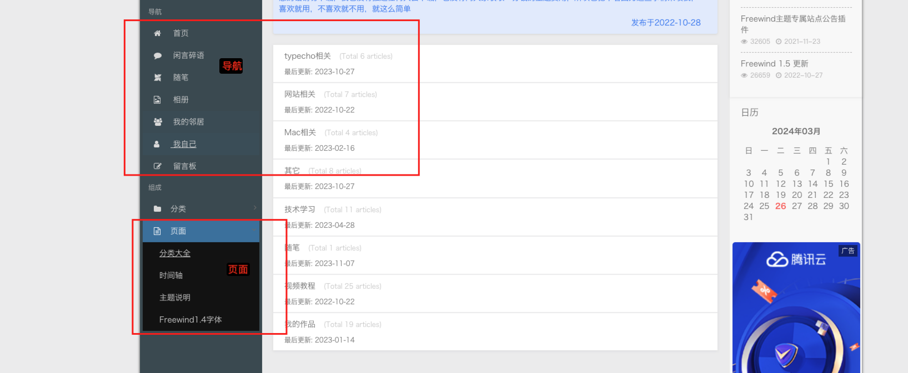

设置页面如图所示，按照提示填入即可，更新排序的话直接双击排序那列的单元格就可以直接编辑，编辑完后点保存即可

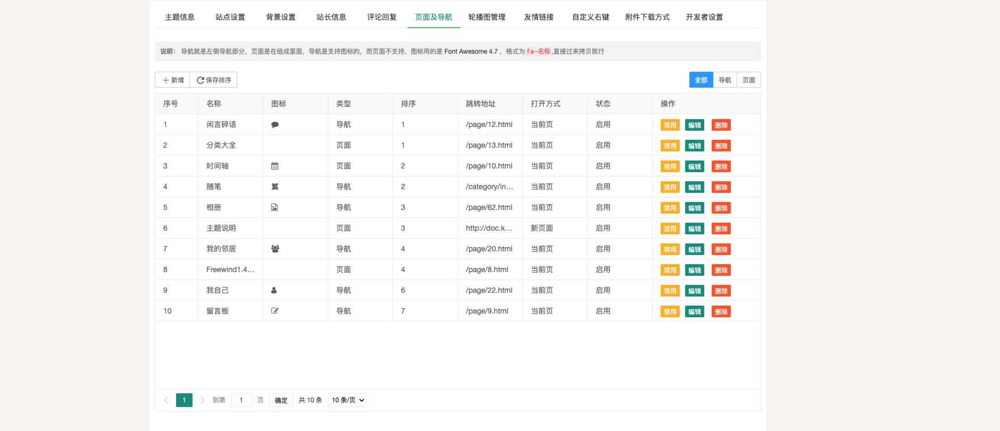


# 轮播图管理

设置页面如图所示，按照提示填入即可，图片支持外链及直接上传，更新排序的话直接双击排序那列的单元格就可以直接编辑，编辑完后点保存即可

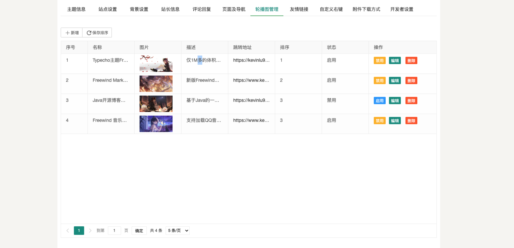

# 友情链接管理

- 友链展示数量：除了友情链接独立页面外的其它地方(底部及右侧栏)最大显示多少条友链,0或不填表示所有
- 友链默认描述：当友链描述没有填写时展示的描述信息
- 展示友情链接：除了友情链接独立页面外的其它地方(底部及右侧栏)是否展示友情链接
- 站点图标这里如果不填会默认取`目标站点/favicon.ico文件`
- 友链在前台展示的顺序是随机无排序的

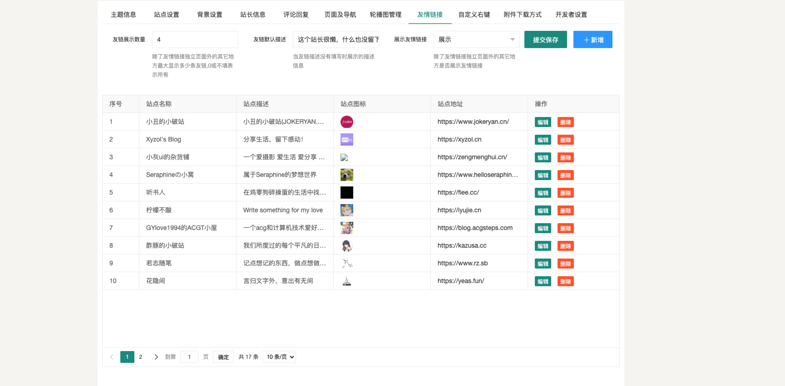

# 自定义右键菜单设置

替换浏览器默认的右键功能，转而换成可以由用户自定义的设置，设置跳转链接及JS脚本两种设置

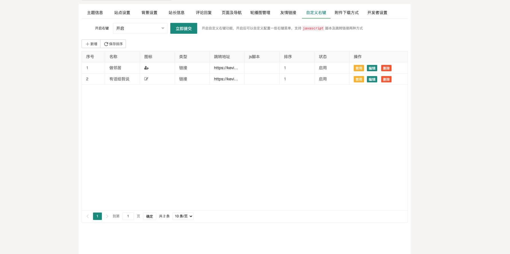

# 附件下载方式设置

只有在这里设置了附件下载方式，在文章页才会有`Freewind`主题的专属附件设置，前台也会根据这里设置的图标及名称做对应的渲染

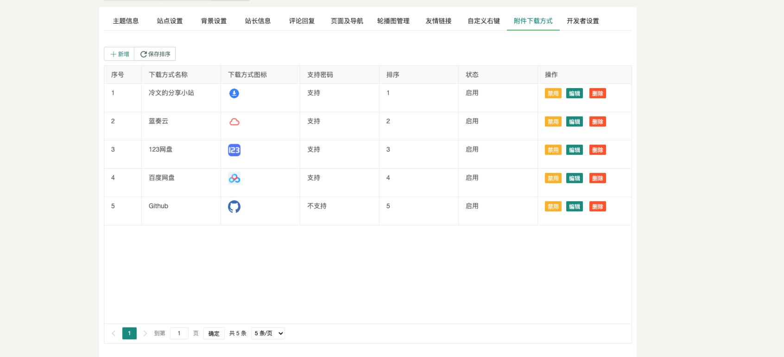

后台文章设置

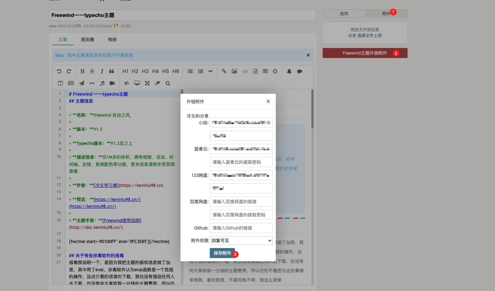

前台展示

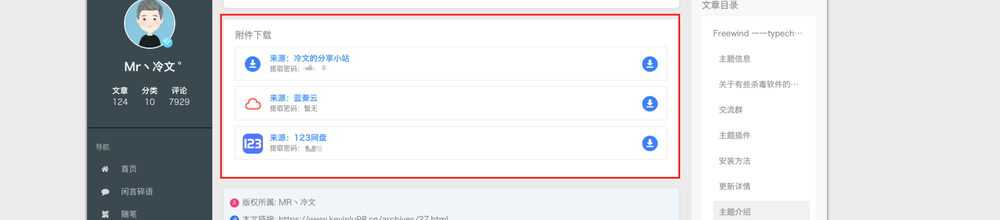

# 开发者设置
这里的设置大家不懂的话就保持默认即可

- 开启自定义静态资源: 允许自定义静态资源的路径，开启后站点将采用你自定义的路径来加载静态资源，可前往 [传送门](https://github.com/kevinlu98/freecdn) 下载对应主题版本的静态资源来避免cdn挂了出现一些功能不可用

- 静态资源路径: 静态资源前缀, 请以"/"结尾，请确保已开启自定义静态资源路径

- 全局css: 控制主题的CSS样式，全局生效，请在外层加上 style标签，主题会将其放入head部分

- 全局JS: 控制主题的脚本，全局生效，请在外层加上 script 标签，下面给出一个统计代码的例子

```html
<script>
var _hmt = _hmt || [];
(function() {
  var hm = document.createElement("script");
  hm.src = "https://hm.baidu.com/hm.js?123456";
  var s = document.getElementsByTagName("script")[0]; 
  s.parentNode.insertBefore(hm, s);
})();
</script>
```

- PJAX回调: 如果你使用的插件有支持PJAX，请按照插件说明将PJAX回调的代码写在这里, 如果你用的`freewind`主题全家桶的话，请按照我下面的代码进行设置

```javascript
if ($('#fw-is-available-mathjax').data('value') === 1) {
    renderMathInElement(document.body, {
        delimiters: [
            {left: '$$', right: '$$', display: true},
            {left: '$', right: '$', display: false},
            {left: '\\(', right: '\\)', display: false},
            {left: '\\[', right: '\\]', display: true}
        ],
        throwOnError: false
    });
}
if ($('#fw-is-available-code').data('value') === 1) {
    $("#fw-article-content").on('click', '.fwh .fwthead', function () {
        $(this).parent().children('.fwthead').removeClass('fwcurrent')
        $(this).addClass('fwcurrent')
        $(this).parent().parent().find('.fwtbody').hide()
        $(this).parent().parent().find(`.fwtbody-${$(this) . data('target')}`).stop().fadeIn()
    })
    $("#fw-article-content .fwtab .fwh .fwthead:first-child").click()
}
if ($('#fw-is-available-flowchart').data('value') === 1) {
    $('#fw-article-content code.lang-flow').each((index, element) => {
        chart = flowchart.parse($(element).text());
        $(element).parent().after(`<div id="canvas-${index}"></div>`).remove()
        chart.drawSVG(`canvas-${index}`);
        $(`#canvas-${index}`).prev('.mac-bar').remove()
    })
}
if ($('#fw-is-available-sequencediagram').data('value') === 1) {
    $('#fw-article-content code.lang-seq').each((index, element) => {
        let code = $(element).text()
        $(element).parent().after(`<div id="seq-${index}">${code}</div>`).remove()
        $(`#seq-${index}`).sequenceDiagram({theme: 'simple'});
        $(`div#seq-${index}`).prev('.mac-bar').remove()
    })
}
```

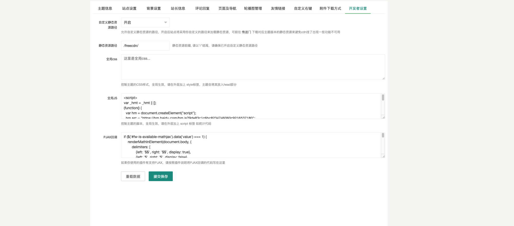