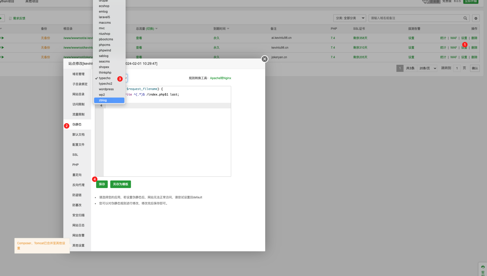
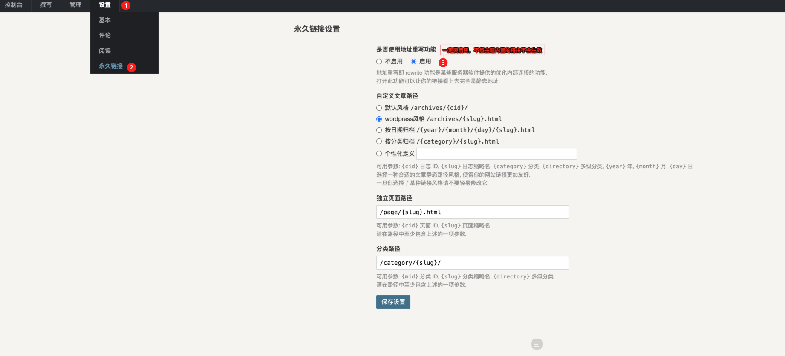
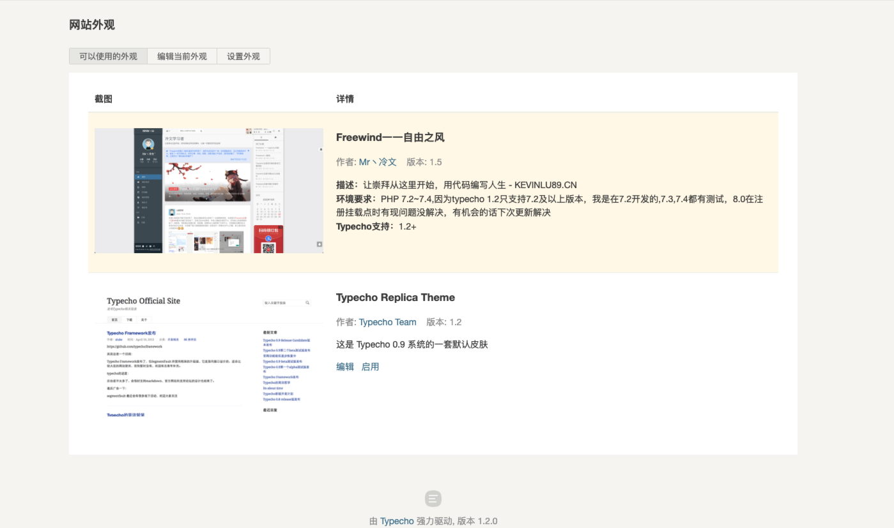

# 主题获取
- Github获取: [传送门]()

- 冷文学习者主题发布页获取: [传送门](https://kevinlu98.cn/archives/27.html)

# 主题安装

- 站点开启伪静态，不会的可以直接百度，有很详细的教学，下面我以宝塔为例

- 在`Typecho后台->设置->永久链接`开启地址重写功能，不然我自定义的一些路由用不了

- 上传并解压主题到`站点根目录/usr/themes`

- 确保主题文件夹名为`Freewind`

- 进入站点后台更换外观选择该主题即可

>**站点一定要设置伪静态，至于怎么设置自行百度一下，很简单,一定要在永久链接中启用地址重写功能** **注: 若实在不会更换typecho主题请自行百度，有详细说明**

# 主题数据库表

大部分主题的设置是在`Typecho`本身的`option`表中，我专门把设置里的所有数据都有对应的表，这样在大家切换主题的时候`Freewind主题`的设置数据就不会丢失了，虽然加了这么些表，但我在查询时是做了缓存的，所以大部分情况下都不会直接去查数据库

|   表名| 备注  |
| ------------ | ------------ |
|freewind_banner  | 轮播图   |
|freewind_friendly | 友情链接  |
|freewind_file | 自定义附件方式  |
|freewind_navigation|导航及页面|
|freewind_option|主题设置|
|freewind_right|自定右键|